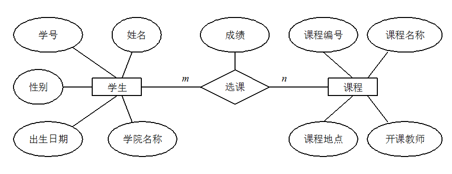

- **元组**：数据库表中的每行就是一个元组。
- **码**：码就是能唯一标识实体的属性，对应表中的列。
- **候选码**：若关系中的某一属性或属性组的值能唯一的标识一个元组，而其任何子集都不能再标识，则称该属性组为候选码。例如：在学生实体中，“学号”是能唯一的区分学生实体的，同时又假设“姓名”、“班级”的属性组合足以区分学生实体，那么{学号}和{姓名，班级}都是候选码。
- **主码** : 主码也叫主键。主码是从候选码中选出来的。 一个实体集中只能有一个主码，但可以有多个候选码。
- **外码** : 外码也叫外键。如果一个关系中的一个属性是另外一个关系中的主码则这个属性为外码。一个表可以有多个外键，可以与多个表建立联系。
- **主属性**：候选码中出现过的属性称为主属性。比如关系：工人（工号，身份证号，姓名，性别，部门）。显然工号和身份证号都能够唯一标示这个关系，所以都是候选码。工号、身份证号这两个属性就是主属性。如果主码是一个属性组，那么属性组中的属性都是主属性。
- **非主属性：** 不包含在任何一个候选码中的属性称为非主属性。比如在关系：学生（学号，姓名，年龄，性别，班级）中，主码是“学号”，那么其他的“姓名”、“年龄”、“性别”、“班级”就都可以称为非主属性。
- **ER 图**：全称是 Entity Relationship Diagram（实体联系图），提供了表示实体类型、属性和联系的方法。由下面 3 个要素组成：

  - _实体_：通常是现实世界的业务对象。比如对于一个校园管理系统，会涉及学生、教师、课程、班级等等实体。在 ER 图中，实体使用**矩形框**表示。
  - _属性_：即某个实体拥有的属性，属性用来描述组成实体的要素。在 ER 图中，属性使用椭**圆形**表示。
  - _联系_：即实体与实体之间的关系，在 ER 图中用**菱形**表示，这个关系不仅有业务关联关系，还能通过数字表示实体之间的数量对照关系。例如，一个班级会有多个学生就是一种实体间的联系。

  下图是一个学生选课的 ER 图，每个学生可以选若干门课程，同一门课程也可以被若干人选择，所以它们之间的关系是多对多（M: N）。另外，还有其他两种实体之间的关系是：1 对 1（1:1）、1 对多（1: N）。 

* **数据库基本范式**：
  - 第一范式：属性（对应于表中的字段）不能再被分割，也就是这个字段只能是一个值，不能再分为多个其他的字段了。**1NF 是所有关系型数据库的最基本要求** ，也就是说关系型数据库中创建的表一定满足第一范式。
  - 第二范式：2NF 在 1NF 的基础之上，消除了非主属性对于码的**部分函数依赖**。
    - **函数依赖（functional dependency）**：若在一张表中，在属性（或属性组）X 的值确定的情况下，必定能确定属性 Y 的值，那么就可以说 Y 函数依赖于 X，写作 X → Y。
    - **部分函数依赖（partial functional dependency）**：如果 X→Y，**并且存在 X 的一个真子集 X0**，使得 X0→Y，则称 Y 对 X 部分函数依赖。
    - **传递函数依赖**：在关系模式 R(U)中，设 X，Y，Z 是 U 的不同的属性子集，如果 X 确定 Y、Y 确定 Z，且有 X 不包含 Y，Y 不确定 X，（X∪Y）∩Z=空集合，则称 Z 传递函数依赖（transitive functional dependency）于 X。传递函数依赖会导致数据冗余和异常。传递函数依赖的 Y 和 Z 子集往往同属于某一个事物，因此可将其合并放到一个表中。比如在关系 R（学号 , 姓名, 系名，系主任）中，学号 → 系名，系名 → 系主任，所以存在非主属性系主任对于学号的传递函数依赖。
  - 第三范式：3NF 在 2NF 的基础之上，消除了非主属性对于码的传递函数依赖 。符合 3NF 要求的数据库设计，**基本**上解决了数据冗余过大，插入异常，修改异常，删除异常的问题。

上述内容参考了：[Java Guide](https://javaguide.cn/)。
