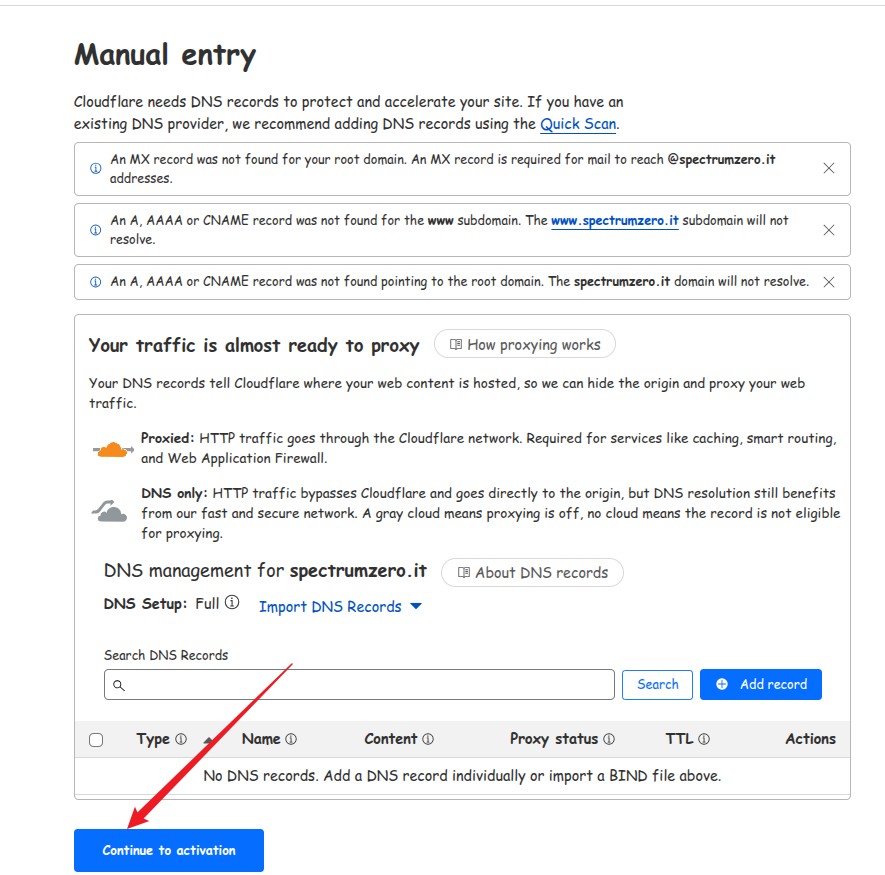

### 写在前面

首先，这不是一个完全手把手的指导，说明并不会事无巨细地展开。原因有两个，一是我认为我所略过的部分，完全可以通过查阅官方文档而**快速而精准**地解决，而不需要经过二次加工；第二是如果嫌麻烦，也完全可以问 ai 来解决——关于 ai，我十分推荐谷歌面向开发者的[Google AI Studio](https://aistudio.google.com/prompts/new_chat)。我所提供的不是信息的重复，而是信息的聚合与组织，让你**足以**根据这个线路搭建自己的个人网站。

### 准备工作

0. 一个 ai 工具，ai 现在几乎成了更快的搜索引擎，请积极利用它。我没有那么详细描述的部分你可以直接 copy 我的描述然后提出你的 prompt。
1. 一个 terminal 和一个 shell
   - 对于 windows 用户，你*应该*使用 windows terminal + powershell 7
   - 对于 Linux 用户，你可以使用 Kitty + fish
   - 高贵的 mac 用户请自行 ai。
2. 一个包管理器，这会简化后面很多的安装步骤
   - 对于 windows 用户，你可以使用 scoop
   - 其他操作系统的用户可以根据自己的操作系统来决定。我使用的是 yay。
3. 一个代码编辑器，比如[vscode](https://code.visualstudio.com/docs)。它被用来编辑配置文件，也可以用来编辑我们的博客文章。在 terminal 中使用包管理器安装即可，具体如何安装和使用请自行 ai 或查阅对应文档。
4. **通畅的网络环境**。遇到网络问题请使用代理+tun 模式。Mihomo 和 Clash 都支持 tun 模式。还有一种比较少见的情况是，尽管你开了代理和 tun，但 shell 没有使用代理，因此获取不到资源，那么这个时候你就应该设置一下 shell 的代理。

### 安装 Hexo 与初始化项目

这个部分请先查阅[官方文档](https://hexo.io/zh-cn/docs/#%E5%AE%89%E8%A3%85)。

它会要求你安装了 git 和 node.js 之后再安装 hexo 这个博客框架。那么，你应该在你的 terminal 中，利用 shell，通过你上一步安装了的包管理器，**使用命令行**去安装 git 和 node.js，并验证是否安装成功。

比如对于[scoop 安装 git](https://scoop.sh/#/apps?q=git&p=2)：

```pwsh
scoop install main/git
```

验证 git 是否安装成功，输出版本号则表示安装成功：

```pwsh
git -v
```

对于 node.js：

```
scoop install main/nodejs
```

验证：

```pwsh
node -v
```

之后就根据文档的说明，使用命令行安装 hexo 即可：

```bash
npm install -g hexo-cli
```

_注意因为是`-g`全局安装，所以可能需要管理员权限_。

我们已经安装了 hexo 框架，但还没有使用它来帮助我们初始化一个网站项目，现在在命令行中键入并回车（`hexo-site`可以是其它你喜欢的任何名字）：

```bash
hexo init hexo-site
```

这会在**当前目录**下生成一个名字为`hexo-site`的文件夹（如果你对当前目录的位置不满意，可以利用`cd`指令来改变当前目录，或者使用`mkdir`指令创建一个新的目录，然后`cd`进入这个新的目录）。这个文件夹就是你的网站在你本地计算机上的一个映射。然后我们进入这个文件夹：

```
cd hexo-site
```

这个时候我们其实可以在本地预览一下网站了。依次在命令行界面中（注意你现在应该处在网站项目的**根目录**下）使用`hexo c`，`hexo g`，`hexo s`，完成清理缓存、生成、本地预览。最后的`hexo s`命令的执行结果，会返回一个端口号（一般是 4000），打开浏览器，在地址栏输入`localhost:4000`，就会看到一个很朴素的网站界面，使用的是默认主题，所以下面我们要更换、自己配置主题。

_注意，当你预览网站的时候，会占用一个端口，即 4000，在执行`hexo s`并预览了网页后，你可以回到命令行界面，按下`ctrl+c`键盘，终止预览，为下一次的预览空出 4000 端口_。

我们将会使用[NexT 主题](https://github.com/next-theme/hexo-theme-next)，因为它保持了简洁的同时，还提供了丰富的配置选项和足够详细的文档支持，以及它还在[积极地更新迭代中](https://github.com/next-theme/hexo-theme-next/releases/tag/v8.23.1)，后续应该会推出更多好玩的功能。这个主题其实已经有 10 多年的历史了，如今这个 2.6k star 的是它 2020 年之后的版本，而之前的版本有 8.2k star[^1]。

当然，你也可以使用像[butterfly](https://github.com/jerryc127/hexo-theme-butterfly)这样的卡片式主题（上一次 release 在 25 年 3 月），或者是[fluid](https://github.com/fluid-dev/hexo-theme-fluid)这样也很综合全面的主题（上一次 release 在 24 年 7 月），不同的主题有不同的安装方式。你可以在[这里](https://hexo.io/themes/)找到你喜欢的主题列表。但是在选择主题时，除了外观以外，很重要的一点是它有没有得到持续的维护，有没有详细的文档，以及允许自定义的选项是否达到了你的需求。

让我们继续。

### 使用 NexT 主题

#### 安装与更新

同样的，请先查看[官方文档](https://theme-next.js.org/docs/getting-started/#NexT-Installation)。

官方文档提供了两种安装（和更新）主题的方式。**推荐使用 npm 的安装方式**，因为这样后续的更新会非常方便。使用 git 除了需要手动`git clone`（这会让你的项目多出一个`themes/next`文件夹，这个文件夹以项目子模块的形式被纳入了 git 管理），手动`git pull`以外，由于要考虑到这个 git 子模块，也让你不太好管理你整个项目的源代码。

正如文档所说，在你的项目根目录运行安装命令即可：

```bash
npm install hexo-theme-next
```

对于后续的更新：

```bash
npm install hexo-theme-next@latest
```

#### 启用与配置

来自官方文档的[这个部分](https://theme-next.js.org/docs/getting-started/#Hexo-Configuration)。

在安装了主题之后，你需要在**hexo 的配置文件，即根目录下的`_config.yml`文件**中启用这个主题。如果你之后打算使用其他主题，也在这个文件中做出修改就好：

```yml
theme: next
```

这个时候你可以在命令行界面中，在网站项目的**根目录**下执行`hexo c`->`hexo g`->`hexo s`，浏览器地址栏`localhost:4000`查看启用主题后的网站了。

hexo 的配置文件用来配置你网页中最基本的信息，比如名称、链接、部署方式等这些**与主题无关**的选项，而下面介绍的 next 的配置文件，则是配置你网页的外观、功能的主要位置。

首先，我们需要利用命令行，创建我们的主题配置文件，这份文件将会被放在项目根目录中：

```shell
cp node_modules/hexo-theme-next/_config.yml _config.next.yml
```

之后我们就可以在`_config.next.yml`文件中进行各种好玩的配置，它们最终都会覆盖默认的配置并生效。你可以随时`hexo c`->`g`->`s`->`localhost`查看，并`ctrl+c`结束预览。`hexo c`和`hexo g`并不总是必要的，但当效果不同于你的预想的时候，你总是可以且应该先清除缓存，并重新生成。

#### 下一步的配置

后续的自定义其实很丰富了。但有必要再强调一下：

- 当你想要自定义**不**依赖于主题的选项时，如：
  - 创建新的页面——例如`about`用来展示自己，`links`用来放你和你的朋友们，`tags`来展示文章标签——应该去看的是[hexo 的文档](https://hexo.io/zh-cn/docs/commands)，[next 的相关文档](https://theme-next.js.org/docs/theme-settings/custom-pages)可以作为更全面的支持。
  - 创建新的文章或制定文章的 scaffold，查看[hexo 的文档](https://hexo.io/zh-cn/docs/writing)。
  - 配置网站的标题、描述、作者名、网址等等这些不依赖于任何主题的选项时，查看[hexo 的文档](https://hexo.io/zh-cn/docs/configuration)。
- 当你想要自定义依赖于主题的选项时，你应该看的是[next 的文档](https://theme-next.js.org/docs/theme-settings/)，除了这个超链接，官网中还提供了其他的板块来供游玩，请自行游玩。
- 总之，你应该在 hexo 的文档和 next 的文档之间做出区分。与主题无关的，在`_config.yml`里配置或在命令行中执行以`hexo`开头的命令；与主题有关的，则在`_config.next.yml`中配置。**勤查文档，查对文档**。
- 可以自行谷歌其他人写的 hexo next 主题美化博客。这里就不赘述了。对于用户来讲，配置在技术上没有什么难度，就是一些选择题。
- 当然，你也可以直接借鉴别人的配置文件进行美化，比如[我的](https://github.com/spectrumzero/my_site/blob/main/_config.next.yml)。

### 部署上线

目前，我们的网站只能通过本地预览的方式，被我们自己看到。下一步我们就让它上线，成为整个互联网的一份子。

#### 在 github 上创建一个公有仓库

当然，在你创建仓库之前，你需要登陆或注册一个 github 账号。

登陆之后，你有两个选项：

1. 创建一个名字为`github.username.io`的特殊仓库，它表示你在 github pages 上的个人主页，或根地址。如果创建这个仓库，那么之后你的网站的域名就是`github.username.io`。
2. 创建一个名字为任意的仓库，例如`site`。如果这样创建，那么之后你的网站的域名就是`github.username.io/site/`，会比较长。

有的人可以接受`github.username.io`这个域名，但有的人想要实现域名的自定义。如果是后者，那么其实选项一和选项二都无所谓，甚至选项二更好，因为它没有占用唯一的特殊名字，就像一个普通的仓库。我想要自定义域名，所以选择了选项二。对于不想要自定义域名的读者，选择选项一就好了，选项二相对于选项一只是多了一个自定义域名的步骤，不影响接下来的配置。

**但是请注意，如果你打算自定义域名，那么我建议选择选项二。因为之后自定义域名的步骤是基于我自身“`github.username.io/site`这个域名太长了”这个痛点牵引出来的，所以可以保证从选项二到自定义域名的过渡会相当顺利。当然，如果你选择了选项一，之后又想自定义域名，我觉得也没有任何问题，只是我自己没有经历过这个过程，所以不能保证不会出现非预期后果，但我个人觉得，其实后续的操作都是共通的**。

怎么创建 github 仓库请自行 ai。注意都要是**public**的。

#### 指定部署方式

我们使用 git 来完成部署。前面已经安装了 git，但是如果想要畅快使用 git，建议再做两件事：

1. *全局*配置 git 的用户名和邮箱，这是必须完成的初始化操作。
2. 设置 github 的公钥，让自己有推送权限，如果没有设置，将来 push 的时候会提醒你设置。

这二者麻烦自行 ai。然后我们查看[hexo 文档](https://hexo.io/zh-cn/docs/one-command-deployment)，继续下一步。

在`_config.yml`中配置部署方式。指定部署的类型，刚刚在 github 上新建的远程仓库的名称，以及远程 repo 的分支。这里以我的仓库为例，建议使用 ssh 来指定仓库，避免网络问题（下面的 repo 项好像被阻挡了不能正常显示，完整的应为`git@github.com:spectrumzero/my_site.git`）：

```yml
deploy:
  type: "git"
  repo: git@github.com:spectrumzero/my_site.git
  branch: gh-pages
```


_注意，之所以将分支设置为`gh-pages`，是为了将整个项目的源代码和经过生成部署后的产物分开，以便更好地管理我的整个网站项目。在部署的时候，部署产物（Build Output）将会被推送到`gh-pages`分支，在此之后，自己则可以选择是否要将源代码推送到 main 分支。_

最后在同一个文件中指定网站的`url`即可，比如对于选项一：

```yml
url: https://spectrumzero.github.io/
```

对于选项二：

```yml
url: https://spectrumzero.github.io/my_site
```

#### 部署

进入你的项目的根目录，利用命令行安装部署插件：

```bash
npm install hexo-deployer-git --save
```

这样我们就可以使用 git 进行部署了，同样在根目录下，`hexo c`->`hexo g`，可以选择要不要`hexo s`预览效果，然后直接：

```bash
hexo d
```

然后去远程 repo 中查看：


当`github-pages`旁边的图标变成绿色的，我们就完成了部署，可以直接通过域名访问更新后的网站了，在地址栏输入`github.username.io`或`github.username.io/sitename`即可。

### 自定义域名

如果想要获得更加个性化的域名，那么请阅读这一节。

#### 购买域名

有很多地方可以买到域名。我个人比较推荐的是[porkbun](https://porkbun.com/)，因为你可以看到下一年续费需要多少钱，这个方面是比较透明的。而且也比其他商家比如 Namecheap 便宜，当然，也没有备案的说法。还有，如果你办理了[GitHub Student Developer Pack](https://education.github.com/pack)，那么 Namecheap 好像可以免费提供域名[^2]（可惜我当时没有看到）。porkbun 支持 alipay，其他的商家可能不支持，但即便不支持，你或许也可以谷歌一下 wildcard。

下面以猪肉包举例：

1. 注册并登陆，进入这个页面，然后搜索你想要的域名
   
2. 之后就会探出很多不同后缀的域名，选择喜欢的，购买结账就可以了。
3. 购买成功之后，你的域名就会在首页的下方展示，点击`details`，并关注`NAMESERVERS`选项，因为后面会用到：
   

#### 添加自定义域名文件 CNAME

在项目的**根目录下的`source/`文件夹中**，创建`CNAME`文件，没有后缀，全部大写，然后在文件夹中写入我们购买的域名，比如我的：

```CNAME
www.spectrumzero.me
```

这一步是告诉 github pages，我们的项目最终会绑定哪个域名。

#### 设置 github pages

如下图所示，点到指定的区域，重点关注红框区域中的内容，`Source`中选择`Deploy from a branch`，然后在`Branch`中选择我们之前在`_config.yml`的`deploy`部分所指定的分支，以及`/root`目录：


#### 设置域名 DNS 解析

我们使用[Cloudflare](https://www.cloudflare.com/zh-cn/)来完成最终的域名解析。

##### 登陆 Cloudflare 并获取新的域名服务器地址

一般如果是新用户，就会有新手引导界面，跟随引导界面即可。如果没有，可以如图点击：





在最终的界面中，这两个就是我们需要的域名服务器的地址，把它们复制下来。


##### 更改 porkbun 中默认的域名服务器地址

回到猪肉包中，改变`NAMESERVERS`中的内容即可。先清空，再把上面的两个地址一个一个粘贴进去，提交后就是下面的样子。


之后再回到 cloudflare 的界面，检查一下域名服务器：


这个过程一般会在 10 分钟之内完成。当这里变为“Active”的时候，我们就可以进行最后一步了。


最后一步也很简单，点进我的截图所指的位置：


你一共需要在弹出框中填写两次列表，我还是以我的为例：


第一次：`CNAME`->`www`->`spectrumzero.github.io`->`proxied`->`Auto`
第二次：`CNAME`->`@`->`spectrumzero.github.io`->`proxied`->`Auto`

第二次是为了方便别人可以直接通过`spectrumzero.me`来访问我的网站，而不必输入`www.spectrumzero.me`。

_请注意，这里的`Target`应该是 github pages 的根域名，后面没有路径_。

最后记得保存即可，效果：


然后回到`_config.yml`文件中，将`url`一行换成你最终自定义的域名即可，如：

```yml
url: https://www.spectrumzero.me
```

之后，在项目的根目录执行`hexo c`->`hexo g`->`hexo d`，你的项目就会部署到指定的域名上了。第一次部署的时间可能会稍微会长一点，耐心等待即可。稍后即可以你喜欢的域名访问你的网站了。

### 结语

现在我们可以通过`github.username.io`，或者是自定义的域名来访问我们的网站了。这也是我的这个网站诞生的过程。网站只是一种呈现的方式，而在哪里记录则有十分丰富的选择。所以写作的流程不一定是`hexo new "Hello World"`，然后就很规矩地在这个网站项目的本地文件夹中写。我更喜欢的方式是，先在专门的 Obsidian Vault 中写好，然后再把文字复制到那个新的博客 markdown 中，把图片放到对应的文件夹里。这样就最大程度地避免因为呈现的繁琐而不愿意呈现。某种程度上，"_Learn in public_"确实很有道理。

_提示：为了方便管理图片，很推荐一篇文章一个文件夹的做法，可以参看这个[链接](https://chrismroberts.com/2020/01/06/using-markdown-in-hexo-to-add-images/)。以及对于那些非文章的图片，也就是可能用来配置网站的图片，建议放在根目录下的`source/images`文件夹下。这一点也可以参照[hexo 官方文档](https://hexo.io/zh-cn/docs/asset-folders)_。

现在，远程仓库只有一个分支，也就是`gh-pages`分支。这个分支是由源代码构建的产物。你可以选择将你的源代码推送到远程仓库的**另外一个分支**，以便实现更好的管理。需要先在网站根目录中执行`git init .`来将整个项目纳入 git 的追踪，之后的步骤则请自行 ai。

最后，如果需要的话，你也可以参考我的[源代码分支](https://github.com/spectrumzero/my_site/tree/main)。

[^1]: https://theme-next.js.org/docs/getting-started/upgrade
[^2]: https://education.github.com/experiences/virtual_event_kit
