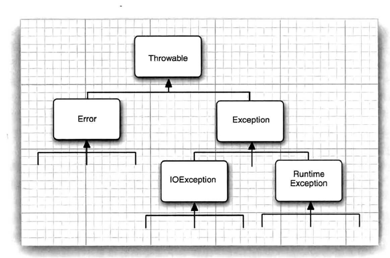

## 入口

- `@SpringBootApplication`: Spring Boot 应用的核心注解，通常用于标注主启动类。可以把 `@SpringBootApplication`看作是下面**三个注解的组合**：
  - `@EnableAutoConfiguration`：启用 Spring Boot 的自动配置机制。
  * `@ComponentScan`：扫描 `@Component`、`@Service`、`@Repository`、`@Controller` 等注解的类。
  * `@Configuration`：允许注册额外的 Spring Bean 或导入其他配置类。

* `@MapperScan`: 这是 MyBatis-Spring 提供的注解。它告诉框架去哪里查找 Mapper 接口。它会扫描指定的包，并将其中定义的接口注册为 Spring Bean。

## Bean 注册

Spring 容器需要知道哪些类需要被管理为 Bean。除了使用 `@Bean` 方法显式声明（通常在 `@Configuration` 类中），更常见的方式是使用 Stereotype（构造型） 注解**标记类**，并配合组件扫描（Component Scanning）机制，让 Spring 自动发现并注册这些类作为 Bean。这些 Bean 后续可以通过 `@Autowired` 等方式注入到其他组件中。下面是常见的构造型注解：

- `@Component`：通用的注解，可标注任意类为 Spring 的组件。如果一个 Bean 不知道属于哪个层，可以使用`@Component` 注解标注。
- `@Repository` : 对应持久层即 Dao 层，主要用于数据库相关操作。
- `@Service` : 对应服务层，主要涉及一些复杂的逻辑，需要用到 Dao 层。
- `@Controller` : 对应 Spring MVC 控制层，主要用于接受用户请求并调用 Service 层返回数据给前端页面。主要用于传统的 Spring MVC 应用，方法返回值通常是逻辑视图名，需要视图解析器配合渲染页面。如果需要返回数据（如 JSON），则需要在方法上额外添加 `@ResponseBody` 注解。
- `@RestController`：一个组合注解，等效于 `@Controller` + `@ResponseBody`。它专门用于构建 RESTful Web 服务的控制器。标注了 `@RestController` 的类，其所有处理器方法（handler methods）的返回值都会被自动序列化（通常为 JSON）并写入 HTTP 响应体，而不是被解析为视图名称。在现代前后端分离的应用中，`@RestController` 是更常用的选择。
- `@Configuration`: 主要用于声明一个类是 Spring 的配置类。虽然也可以用 `@Component` 注解替代，但 `@Configuration` 能够更明确地表达该类的用途（定义 Bean）。
- `@Bean`: 通常用于标注在方法上，位于一个  `@Configuration`  类中。它告诉 Spring “这个方法会返回一个对象，请把这个对象作为 Bean 注册起来”。它适用依赖注入于你无法修改源代码的第三方库中的类，或需要进行复杂逻辑来创建 Bean（例如，根据条件创建、需要配置多个属性）等情况。
  如果  `@Component`  或  `@Bean`  注解没有明确指定 Bean 的名字，Spring 会根据一定的默认规则来生成 Bean 的名字。对于前者， Bean 的名字将是该类的非限定类名（simple class name）的**首字母小写**；对于后者，Bean 的名字将是  `@Bean` 所注解的方法的**方法名**。

## 依赖注入

- `@Autowired` 用于自动注入依赖项（即其他 Spring Bean）。它可以标注在构造器、字段、Setter 方法或配置方法上，Spring 容器会**自动查找匹配类型的 Bean 并将其注入**。当存在多个相同类型的 Bean 时，`@Autowired` 默认按类型注入可能产生歧义，此时，可以与 `@Qualifier` 结合使用，通过**指定 Bean 的名称**来精确选择需要注入的实例。
- `@Resource(name="beanName")`是 JSR-250 规范定义的注解，也用于依赖注入。它默认按**名称 (by Name)** 查找 Bean 进行注入。如果未指定 `name` 属性，它会尝试根据字段名或方法名查找，如果找不到，则回退到按类型查找（类似 `@Autowired`）。`@Resource`只能标注在字段 和 Setter 方法上，不支持构造器注入。

## 注入配置

- `@Value("${app.name}")`  注入配置文件（如  `application.properties`  或  `application.yml`）中的单个属性值给 Bean 对象的单个属性，可以以冒号的形式提供默认值，如`@Value("${server.port:8080}")`
- `@ConfigurationProperties` 用于将一组相关的配置属性绑定到一个 Bean 对象上，它将配置文件的层次结构映射到 Bean 对象的属性结构。如`@ConfigurationProperties(prefix = "mail")`会绑定以“mail”为前缀的配置文件配置项到一个类上。之后无需在每一个属性上都使用`@Value("${mail.name}")`注解。

## 异常处理

### Review：异常的层次结构

- **Throwable**：所有错误和异常的超类。
- **Error**：严重错误，通常是 JVM 自身的问题，如  OutOfMemoryError、StackOverflowError。程序通常无法处理和恢复，我们一般不捕获  Error。
- **Exception**：程序本身可以处理的异常。它又分为两类： - **Checked Exceptions (受检异常)**：在编译时就必须处理的异常。编译器会强制你使用  try-catch  捕获或者使用  throws  声明抛出。例如  IOException、SQLException。它们通常是程序在与外部环境（如文件、网络、数据库）交互时可能发生的、可预见的问题。 - **Unchecked Exceptions (非受检异常)**：也叫  **RuntimeException**。在编译时不会被检查，在运行时才可能抛出。例如  NullPointerException、ArrayIndexOutOfBoundsException。它们通常是由于程序逻辑错误（Bugs）导致的，是应该在编码阶段就避免的。
  

### Review：异常处理的五个关键字

- **try**：包裹可能会**抛出**异常的代码块。
- **catch**：用于**捕获**并处理  try  块中抛出的特定类型的异常。可以有多个  catch  块来处理不同类型的异常，捕获时遵循**从小到大**的原则（子类异常在前，父类异常在后）。
- **finally**：无论是否发生异常，finally  块中的代码**总会**执行（除非 JVM 退出，如  System.exit()）。通常用于释放资源，如关闭文件流、数据库连接等。
- **throw**：在代码中手动抛出一个异常对象。通常用于在检测到错误条件时主动中断程序流程。
- **throws**：用在方法签名上，声明该方法可能会抛出某些受检异常。**它将处理异常的责任转移给了方法的调用者**。
- **注意**：try-with-resources (Java 7+)是对  finally  块中资源释放代码的巨大简化。任何实现了  java.lang.AutoCloseable  或  java.io.Closeable  接口的资源都可以使用此语法，JVM 会自动为你调用  close()  方法，从而替代了繁琐的 finally 块：

```java
// 传统方式 (繁琐且容易出错)
void copyFileLegacy(String src, String dest) throws IOException {
    FileInputStream in = null;
    FileOutputStream out = null;
    try {
        in = new FileInputStream(src);
        out = new FileOutputStream(dest);
        // ... copy logic ...
    } finally {
        if (in != null) in.close();
        if (out != null) out.close();
    }
}

// try-with-resources 方式 (简洁、安全)
void copyFileModern(String src, String dest) throws IOException {
    try (FileInputStream in = new FileInputStream(src);
         FileOutputStream out = new FileOutputStream(dest)) {
        // ... copy logic ...
    } // in 和 out 会在这里被自动关闭，即使发生异常
}
```

### 使用 Spring 和第三方库进行全局异常处理

传统的 Java Web 开发（如 Servlet）中，每个方法都可能需要写大量的  try-catch  块来**捕获异常**，导致业务逻辑和异常处理逻辑耦合在一起，代码非常臃肿。Spring 框架通过  **AOP (面向切面编程)**  的思想，**将异常捕获的逻辑从业务代码中分离出来**，进行集中管理，完美地解决了这个问题。这主要通过以下注解实现：

- `@ControllerAdvice` / `@RestControllerAdvice` : `@ControllerAdvice` 作用于一个类上，表明这个类是一个“全局异常处理器”。它可以**拦截并处理**所有（或指定包下）`@Controller` 中抛出的异常；`@RestControllerAdvice` 是 `@ControllerAdvice` 和 `@ResponseBody` 的组合。它不仅具备 `@ControllerAdvice` 的功能，还会自动将处理方法的返回值序列化为 JSON 格式。这在构建 RESTful API 时非常常用。
- `@ExceptionHandler` : 这个注解作用于方法上，并且该方法必须位于一个被 `@ControllerAdvice` 或 `@RestControllerAdvice` 注解的类中。**它指定了该方法专门负责处理哪种类型的异常**。当控制器中抛出匹配类型的异常时，Spring 会自动调用这个被注解的方法，并将异常对象作为参数传入。
- `@SneakyThrows`: 当你的方法调用了一个可能会抛出受检异常的、在方法签名上使用了 throws 关键字的方法时，编译器会强制你要么使用 try-catch 来在这里**捕获受检异常**，要么你的这个方法的签名上也加上 throws 关键字**继续抛出受检异常**传递给上层处理。而采用了全局异常处理体系的在现代分层架构中，受检异常，比如一个底层的  IOException  可能需要穿透好几层（Repository -> Service -> Controller）才能最终被  `@RestControllerAdvice`  捕获。这意味着每一层的每个方法签名都得加上  throws IOException。这非常繁琐。Lombok 库的 `@SneakyThrows` 的作用是利用 Java 泛型和类型擦除的一个漏洞，欺骗编译器，让它相信这个受检异常已经被处理了，允许这个受检异常被看作是非受检异常，无 throws 关键字地被抛出，进而简化了代码。当你确定某个受检异常在当前上下文中几乎不可能发生，或者你希望将它交由上层的全局异常处理器来统一处理时，可以使用它来简化代码。
  - _注意_：受检异常是编译器强制你必须处理（try-catch  或  throws）的异常；而非受检异常则由你自行决定是否处理，编译器**完全忽略**它们。出于这个原因，有程序员会倾向于将自定义的业务异常（比如  UserNotFoundException, OrderStateException）定义为非受检异常，以此避免  throws  污染各层接口。

## 控制层

- `@RequestMapping`: 最通用的请求映射注解，用于将 HTTP 请求（URL、请求方法等）映射到控制器的方法上。可以用于类级别（定义基础路径）和方法级别。
- `@GetMapping`: 专门用于处理 HTTP GET 请求，`@GetMapping("users")` 等价于`@RequestMapping(value="/users",method=RequestMethod.GET)`。方法级别。
- `@PathVariable`: 用于**从 URL 的路径中提取值**并绑定到方法参数上，用于参数绑定。例如，从  /users/{id}  中获取  id  的值。
  - _注意_：URL 全称是  **Uniform Resource Locator**（统一资源定位符），一个 URL = 协议+主机名（ip 地址或域名）+端口（80 和 443 会省略）+路径（资源在服务器上的具体位置）+ 查询参数（client 给服务器提供的额外信息，以 ? 开始，用 & 分隔键值对）+片段（指向资源内部的特定部分，又称锚点，以 # 开始）。
- `@RequestParam`: 用于**从请求参数或表单数据中提取值**并绑定到方法参数上，用于参数绑定。例如，从 /users?name=john 中获取 name 的值。
- `@RequestBody`: 用于将 HTTP 请求的 body 内容，即请求体（通常是 JSON 或 XML 数据）反序列化为一个 Java 对象，并绑定到方法参数上。用于参数绑定。
- `@ResponseBody`: 标记方法的返回值应该被直接写入 HTTP 响应体中，而不是被解析为视图。@RestController  已经默认包含了此功能。标记在方法上。
- `@ResponseStatus`: 用于指定方法成功执行后返回的 HTTP 状态码，例如  `@ResponseStatus(HttpStatus.CREATED)`  表示返回  201 Created。

## 第三方库

### Lombok

- `@Data`: 当你给一个类加上`@Data` 注解后，Lombok 会在编译时自动为你生成该类所有字段的 `getter` 方法 (例如 getName())；`setter` 方法 (例如 setName(...))；一个合适的 `toString()` 方法，用于打印对象内容；一个合适的 `equals()` 和 `hashCode()` 方法，用于比较对象是否相等；一个接收所有 final 字段的构造函数。可以把它看作包含了`@Getter`, `@Setter`, `@ToString`, `@EqualsAndHashCode` 和 `@RequiredArgsConstructor`
- `@Getter`: 当你给一个类加上 `@Getter` 注解后，Lombok 会在编译时，为该类中所有非静态的字段生成对应的 getXxx() 或 isXxx() 方法。
- `@NoArgsConstructor`: 生成一个无参构造函数。
- `@AllArgsConstructor`: 生成一个包含所有字段的构造函数。
- `@RequiredArgsConstructor`: 为 final 或标记为 @NonNull 的字段生成构造函数。
- `@Builder`: 实现建造者模式，可以链式调用来创建对象实例。
- `@Slf4j`: "Simple Logging Facade for Java" 的缩写。它是一个日志门面，可以与多种日志实现（如 Logback, Log4j2）配合使用。当你给一个类加上 `@Slf4j` 注解后，Lombok 会在编译时自动为你生成一个名为 log 的静态 final 日志记录器对象。

### MyBatis-Plus

- `@TableName`: 该注解用于指定实体类对应的数据库表名。当实体类名与数据库表名不一致，或者实体类名不是数据库表名的驼峰写法时，您需要使用这个注解来明确指定表名。
- `@TableId`: 该注解用于标记实体类中的主键字段，如果一致则可以省略。
- `@TableField`: 用于非主键字段上，用于当字段名与表的列名不一致，或不是列名的驼峰写法时进行映射。该注解也用来配置自动填充策略。

### Swagger

- `@Tag(name = "...")`: 为控制器类提供一个分组标签，在 API 文档中进行分类。
- `@Operation(summary = "...")`: 为具体的 API 接口方法提供一个简短的摘要描述。
- `@Schema(description = "...")`: 为 DTO 的类或字段提供详细的描述和示例。

### Jackson

- `@JsonFormat`: 用于格式化日期时间字段，确保 Java 的日期对象能够按照一定的格式，如 yyyy-MM-dd HH:mm:ss，序列化为 JSON；同样也确保 JSON 可读字符串能够以一定的格式被转化为 Java 对象。

## 参考

- [Java Guide](https://javaguide.cn/)
- 《Java 核心技术 卷 1 开发基础（原书第十二版）》
